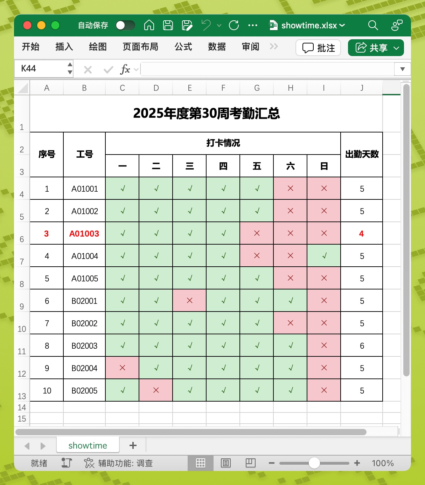

# sheetex

<p align="center">
  
  
  
</p>

12KB 轻量 Excel 导出库，完整样式支持，开箱即用，浏览器 & Node.js

## 特性

- 🚀 高效生成 `.xlsx` 格式的 Excel 文件
- 📦 12KB
  极致轻量（gzip），从零开始编写，仅依赖 [fflate](https://github.com/101arrowz/fflate) & [mustache](https://github.com/janl/mustache)
- 💻 Office Open XML 标准子集，具备良好兼容性，可在 Microsoft Excel、WPS Office、Numbers、macOS/钉钉/微信预览 中正确展示
- 🎨 单元格格式面板完整功能支持：
    - 格式（数字的各种格式化）
    - 对齐（水平、缩进、垂直、方向、自动换行、缩小字体填充）
    - 字体（字体、字形（加粗、斜体）、字号、颜色、下划线、删除线、上标、下标）
    - 边框（上下左右对角线、14种边框样式）
    - 背景色（18种填充样式）
    - 全局设置（单元格合并、行高、列宽）
- 🌐 同时支持 Node.js 和浏览器环境
- 😀 简洁明了的接口，易于理解和使用

## 效果展示

使用本库生成的一个文件在 Microsoft Excel 展示的效果



生成该文件的代码：[demo/showtime.ts](./demo/showtime.ts)

## 取舍

1. 本库主要针对的场景是网页应用后台非常常见的查询结果导出功能，所有的设计均基于此场景进行考量
2. 本库专注于 Excel 文件导出功能，放弃了对 Excel 的解析能力。**因此，本库不适用于读取模版文件并对特定位置进行修改的开发模式
   **
3. 本库专注于最常用的样式，并实现了单元格格式面板中的所有功能，同时放弃了对复杂格式的支持，比如将同一个单元格中的文字设置成多种样式
4. 尊重 Excel 文件中原有的结构和名称，在样式的配置项中尽量复用这些名称
5. 为了简化使用，本库的数据流被设计成单向的，对象只能在初始化时进行配置，实例化后无法修改
6. 为了缩小体积并降低系统复杂度，本库使用 mustache 以模板渲染的方式生成 Excel 内部文件，然后使用 fflate 进行压缩，生成最终的
   Excel 文件

## 安装

使用 npm 安装：

```bash
npm install sheetex
```

使用 yarn 安装：

```bash
yarn add sheetex
```

使用 pnpm 安装：

```bash
pnpm add sheetex
```

## 快速开始

### 基础用法

生成工作表和工作簿：

```javascript
import { WorkSheet, WorkBook } from 'sheetex';

// 生成一个工作表，里面有一个数据块，数据块里有一行数据，第一个列是"hello"，第二列是"world"，数据块左上角位于A1
const ws = new WorkSheet('sheet1', { data: [['hello', 'world']], origin: 'A1' }, {}, {});

// 生成一个工作簿，里面有一个工作表
const wb = new WorkBook([ws]);
```

若是在 Node.js 中

```javascript
// 获取文件的 buffer 形式
const buffer = wb.getZipBuffer();

// 保存到服务器文件系统
fs.writeFileSync('demo.xlsx', buffer);

// 或通过接口返回给用户（以 express 为例）
res.set('Content-Type', 'application/vnd.openxmlformats-officedocument.spreadsheetml.sheet');
res.send(buffer);
```

若是在浏览器中运行

```javascript
// 直接调用保存功能
wb.downloadAs('demo.xlsx');
```

## 例子

跟着示例是最快的学习方式：

1. 如果你已经有数据，但以前只能导出成 CSV 文件，那么参考 [simple.ts](./demo/simple.ts) 可以快速导出成 Excel；
2. 如果你要了解数字的格式化，请参考 [format.ts](./demo/format.ts)
3. 如果你要了解字体相关的设置，请参考 [font.ts](./demo/font.ts)
4. 如果你要了解对齐相关的设置，请参考 [alignment.ts](./demo/alignment.ts)
5. 如果你要了解边框相关的设置，请参考 [border.ts](./demo/border.ts)
6. 如果你要了解背景色相关的设置，请参考 [fill.ts](./demo/fill.ts)
7. 如过你要了解行高、列宽、单元格合并，请参考 [option.ts](./demo/option.ts)

## API

如果你想进一步了解系统，可以查看此处的说明，已经按照从顶层到细节的顺序对用户使用这个库是需要了解的概念进行了罗列。

也可以顺着这里的顺序去阅读源代码，总共就 600 多行。

### 工作簿 WorkBook

一个 WorkBook 相当于一个 Excel 文件，其中可以包含多个工作表，主要职责是对个工作表进行组织，实现文件的生成与保存

```typescript
/**
 * 创建一个工作簿
 * @param workSheets 工作表
 */
new WorkBook(workSheets
:
WorkSheet[]
)

/**
 * 获得当前WorkBook对应的文件 buffer
 * @returns Promise<Buffer> 生成文件的 buffer
 */
WorkBook.getZipBuffer()
:
Promise<Buffer>

/**
 * 在浏览器中下载当前WorkBook对应的文件
 * @param filename 文件名
 */
WorkBook.downloadAs(filename
:
string
):
void
```

### 工作表 WorkSheet

相当于 Excel 文件中一个工作表，每个工作表可以有自己的名称，包含一个或多个数据块，拥有一个样式表，以及一个配置项（包含行高、列宽、单元格合并）

```typescript
/**
 * @param name 工作表名称
 * @param blocks 数据块
 * @param styles 样式表
 * @param options 工作表选项
 */
new WorkSheet(name
:
string, data
:
DataBlock[], style
:
Style, options
:
WorkSheetOptions
)
```

### 数据块 DataBlock

相当于工作表中的一块区域，比如 A1:C5（实际不一定是严谨的矩形），一个工作表可以有多个数据块，多个数据块区域若有重复，则后者的数据会覆盖前者，每个工作表都可以定义起始坐标（数据库中第一个单元格的坐标）。

```typescript
type DataBlock = {
  origin: string; // 数据块起始坐标
  data: DataRow[]; // 数据行
}
```

### 数据行 DataRow

一个数据块可以包含多行数据，每个数据行可以包含多个数据格

```typescript
type DataRow = DataCell[]; // 数据行是数据格的数组
```

### 数据格 DataCell

数据格可以是数字、文本或对象形式，当数据格为对象时，可以额外包含该格的样式信息

```typescript
type DataCell = string | number | {
  value: string | number; style: Style;
}
```

### 单元格格式 Style

类似前端样式中的 class ，针对每个单元格格式，可以定义样式信息，比如字体、颜色、背景色、边框、对齐、格式等，在数据格中可以引用样式信息

```typescript
interface Style {
  formatCode?: string; // 格式化代码
  font?: Font; // 字体
  border?: Border; // 边框
  fill?: Fill; // 填充（背景）
  alignment?: Alignment; // 对齐
}
```

### 格式化代码

可以定义单元格数据的显示格式，比如数字的千分位分隔符、日期的格式等。

```typescript
type FormatCode = string;
```

具体使用示例请查看 [demo/format.ts](./demo/format.ts)

### 字体 Font

字体信息，包含字体名称、大小、颜色、加粗、斜体、删除线、下划线、上标、下标等

```typescript
interface Font {
  sz?: number; // 字体大小
  name?: string; // 字体名称
  color?: string; // 字体颜色
  b?: boolean; // 是否加粗
  i?: boolean; // 是否斜体
  u?: 'single' | 'double' | 'singleAccounting' | 'doubleAccounting' | false; // 下划线样式
  strike?: boolean; // 是否删除
  vertAlign?: 'superscript' | 'subscript' | false; // 上标、下标
}
```

具体使用示例请查看 [demo/font.ts](./demo/font.ts)

### 边框 Border

边框信息，包含上边框、下边框、左边框、右边框、对角线、对角线方向、颜色、线型、线宽等

```typescript
interface Border {
  style?: // 14 种边框样式
    | 'none' | 'dashDot' | 'dashDotDot' | 'dashed' | 'dotted' | 'double' | 'hair' | 'medium' | 'mediumDashDot' | 'mediumDashDotDot' | 'mediumDashed' | 'slantDashDot' | 'thick' | 'thin';
  color?: string; // 边框颜色
  diagonalUp?: boolean; // 上对角线
  diagonalDown?: boolean; // 下对角线

  left?: BorderStyle; // 左边框样式
  top?: BorderStyle; // 上边框样式
  right?: BorderStyle; // 右边框样式
  bottom?: BorderStyle; // 下边框样式
  diagonal?: BorderStyle; // 对角线样式
}
```

BorderStyle 包含 style 与 color 两个属性；

设置 Border 上的 style 与 color 可以代替分别设置 left/top/right/bottom/diagonal

具体使用示例请查看 [demo/border.ts](./demo/border.ts)

### 填充 Fill

填充信息，包含填充颜色与填充模式

```typescript
export interface Fill {
  patternType: // 18 种填充模式，只有 Microsoft Excel 和 WPS Office 兼容所有模式
    | 'none' | 'solid' | 'darkGray' | 'mediumGray' | 'lightGray' | 'gray125' | 'gray0625' | 'darkHorizontal' | 'darkVertical' | 'darkDown' | 'darkUp' | 'darkGrid' | 'darkTrellis' | 'lightHorizontal' | 'lightVertical' | 'lightDown' | 'lightUp' | 'lightGrid' | 'lightTrellis';
  fgColor?: string;
  bgColor?: string;
}
```

注意纯色背景的 patternType 为 solid，填充颜色为 fgColor

具体使用示例请查看 [demo/fill.ts](./demo/fill.ts)

### 对齐 Alignment

对齐信息，包含水平对齐、文本缩进、垂直对齐、文本旋转、自动换行、缩小字体填充等

```typescript
interface Alignment {
  horizontal?: 'left' | 'center' | 'right' | 'fill' | 'justify' | 'centerContinuous' | 'distributed'; // 水平对齐
  vertical?: 'top' | 'center' | 'bottom' | 'justify' | 'distributed'; // 垂直对齐
  indent?: number; // 文本缩进
  textRotation?: number; // 文本旋转
  wrapText?: boolean; // 自动换行
  shrinkToFit?: boolean; // 缩小字体填充
}
```

具体使用示例请查看 [demo/alignment.ts](./demo/alignment.ts)

### SheetOptions

```typescript
export interface SheetOptions {
  mergeCells?: string[]; // 单元格合并
  colWidths?: Size[]; // 列宽
  rowHeights?: Size[]; // 行高
}
```

具体使用示例请查看 [demo/option.ts](./demo/option.ts)

### 合并单元格 MergeCells

可以设置多组要合并的单元格范围，比如 ['A1:C5', 'D1:E2', 'F1:G3']

### 列宽 ColWidths

可以设置多列的列宽，比如 [{min: 1, max: 3, size: 10}, {min: 4, size: 20}]

min 是起始列，max 是结束列，size 是列宽，min 必填，max 可选：

- 当 max 填写且 size 为数字时，表示从 min 到 max 的列宽都是 size；
- 当 max 填写且 size 为数组时，表示从 min 到 max 的列宽依次如 size 数组中所述，数组长度不够时，从头开始循环；
- 当 max 不填且 size 为数字时，表示 min 列的列宽是 size；
- 当 max 不填且 size 为数组时，表示从 min 开始，列宽依次如 size 数组中所述，直到数组耗尽。

### 行高 RowHeights

行高的定义方式与列宽相同，请注意，Excel 中行高和列宽的单位是不同的，单元格对应的行高和列宽为相同的数字并不会显示成正方形

## 贡献

欢迎提交 Issue 和 Pull Request 来帮助改进这个项目。

## 许可证

本项目采用 MIT 许可证。详情请见 [LICENSE](LICENSE) 文件。
